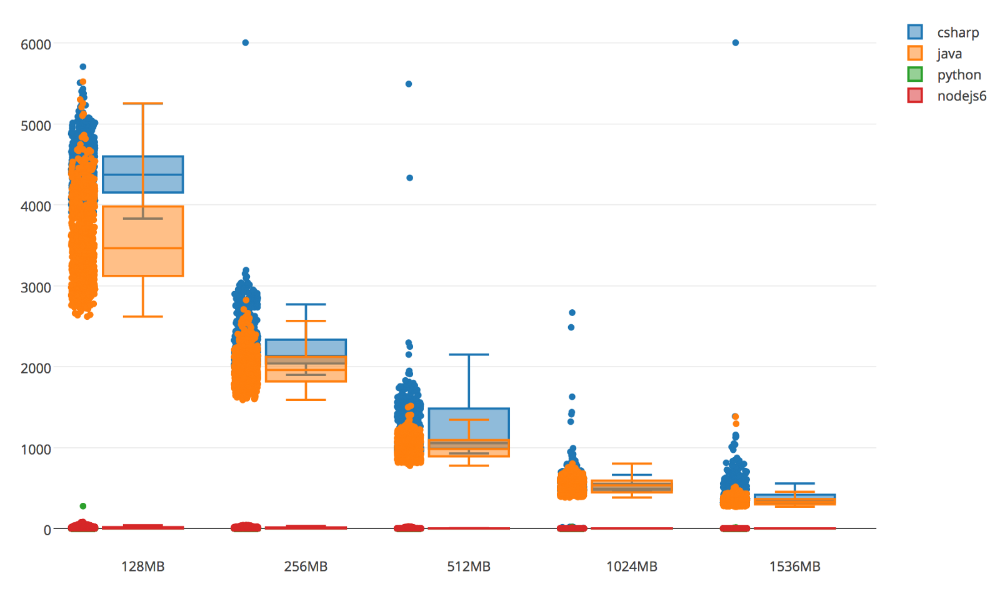
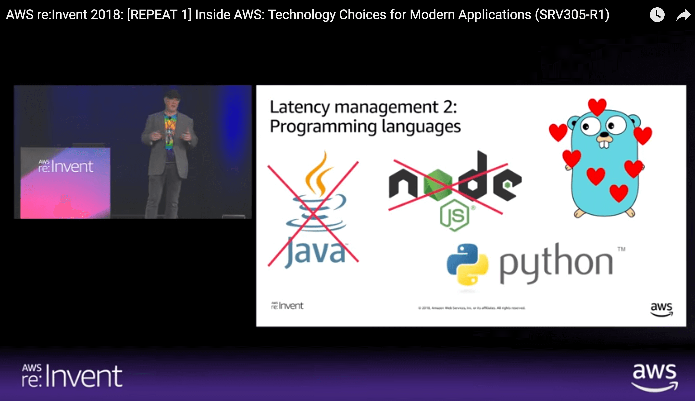
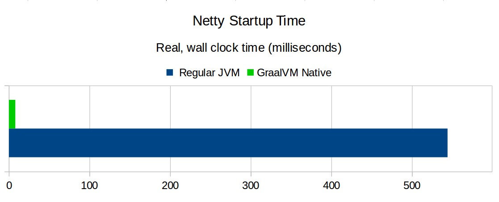
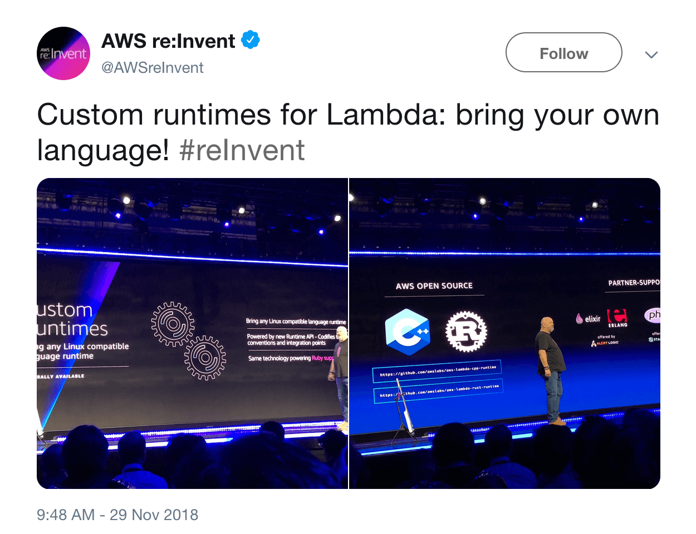
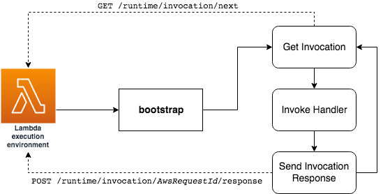

---?image=slides/title.jpg

<h2 style="color:white;">Fighting cold startup issues for your Kotlin Lambda with GraalVM</h2>

---

---?color=#0047b3

## Cold Startup

---

### What is Cold Startup

---

### Cold Startup and the JVM

What is the JVM doing during startup?

- JIT compilation
- garbage collection
- class loading
- static initialization
- ...

---

### Cold Startup and the JVM

<a href="https://theburningmonk.com/2017/06/aws-lambda-compare-coldstart-time-with-different-languages-memory-and-code-sizes/" style="font-size:small;">Yan Cui - aws lambda – compare coldstart time...</a>

---

<a href="https://www.youtube.com/watch?v=IPOvrK3S3gQ" style="font-size:small;">AWS re:Invent 2018: [REPEAT 1] Inside AWS: Technology Choices for Modern Applications (SRV305-R1)</a>

---?color=#0099cc

## GraalVM

---

### GraalVM

@quote[For existing Java applications, GraalVM can provide benefits by running them faster, ... creating ahead-of-time compiled native images.](https://www.graalvm.org/docs/why-graal/)

---

### GraalVM - Native Images

@ul

- GraalVM can create native images for existing JVM-based applications
- native image generation employs static analysis to find any code reachable from the main Java method
- the reachable code is then compiled AOT into machine code
- the resulting executable is self-contained (contains VM components)

@ulend

---

### GraalVM

<a href="https://medium.com/graalvm/instant-netty-startup-using-graalvm-native-image-generation-ed6f14ff7692" style="font-size:small;">Codrut Stancu - Instant Netty Startup using GraalVM Native Image Generation</a>

---?color=#b7410e

## Custom AWS Lambda Runtimes

---

---

### Custom AWS Lambda Runtimes

@ul

- open up AWS Lambda for any programming language
- a runtime is a program that runs the Lambda handler
- can be included in the deployment package

@ulend

---

### Custom AWS Lambda Runtimes

---?color=#092736

## Demo

